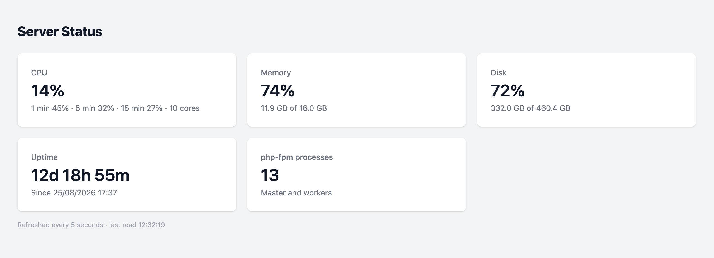

# Laravel Server Status

[](https://github.com/karim-tao/laravel-server-status/actions/workflows/tests.yml)
[](https://packagist.org/packages/karim-tao/laravel-server-status)
[](https://packagist.org/packages/karim-tao/laravel-server-status)

A Livewire component that shows the current CPU, load, memory, disk, uptime and PHP processes of the server. Values are read when the page is open, with no daemon and no database.



Add it to a Blade view:

```blade
<livewire:server-status />
```

Or read the values in code:

```php
$snapshot = app(ServerMetrics::class)->read();

$snapshot->cpu;        // %
$snapshot->memoryUsed; // bytes
$snapshot->diskUsed;   // bytes
```

## Installation

> Requires PHP 8.3+, Laravel 12 or 13 and Livewire 3 or 4.

You can install the package via composer:

```bash
composer require karim-tao/laravel-server-status
```

That's it — the `ServerStatusServiceProvider` and the `server-status` Livewire component are auto-discovered, so you're ready to go.

## Usage

### In your own layout

Embed the component wherever you want, for example in an admin dashboard:

```blade
@extends('admin.layout')

@section('content')
    <livewire:server-status />
@endsection
```

The card refreshes every 5 seconds while it is on screen.

### Standalone page

A ready-made page with the card is available too. Route it with the middleware you prefer:

```php
use KarimTao\ServerStatus\Http\Controllers\ServerStatusController;

Route::get('/server-status', ServerStatusController::class)->middleware('auth');
```

### Reading the metrics yourself

Everything the card shows comes from `ServerMetrics`, which you can use on its own — in a command, an API endpoint or a health check:

```php
use KarimTao\ServerStatus\ServerMetrics;

$snapshot = app(ServerMetrics::class)->read();

$snapshot->cpu;         // percent
$snapshot->load;        // percents over 1, 5 and 15 minutes
$snapshot->cores;       // count
$snapshot->memoryUsed;  // bytes
$snapshot->memoryTotal; // bytes
$snapshot->diskUsed;    // bytes
$snapshot->diskTotal;   // bytes
$snapshot->uptime;      // seconds
$snapshot->process;     // name
$snapshot->processes;   // count
```

## How it works

- **Linux** reads `/proc` and `top`.
- **macOS** uses `sysctl`, `vm_stat` and `top`.
- **Windows** uses PowerShell.
- **Disk** uses PHP's `disk_total_space()` and `disk_free_space()`.
- **Processes** counts the processes named like the one serving the request, `php-fpm` for example.
- **No fallbacks.** A value that cannot be read throws `MetricUnavailableException`, saying what failed.

## Testing

```bash
composer test
```

Each reader is tested on its own system and skipped elsewhere.

## License

Laravel Server Status is open-sourced software licensed under the [MIT license](LICENSE.md).
